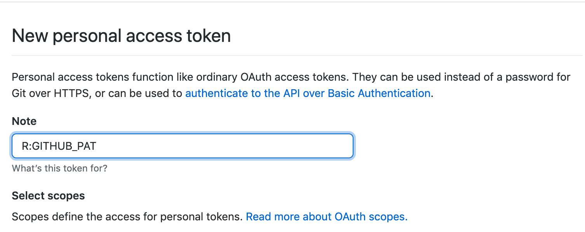
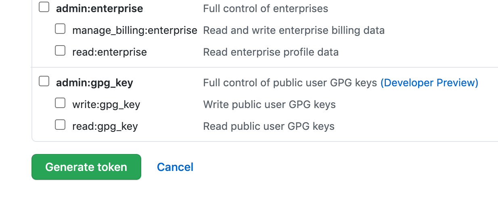
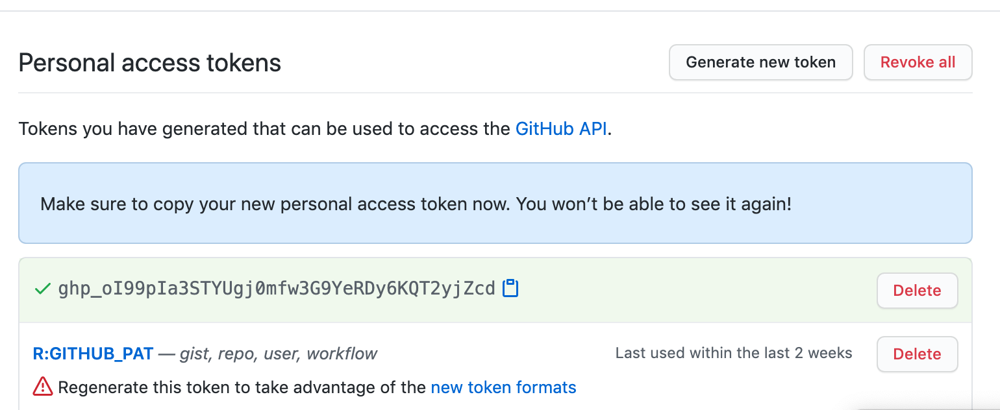

# Primeiro Passo

Crie uma conta gratuita no Github

```{r git, echo=FALSE, fig.cap="Github", out.width = '100%'}

```


# Segundo Passo

[Faça o download do GIT clicando aqui](https://git-scm.com/downloads) 


# Terceiro Passo

Baixe o Pacote Usethis e ative. 

```
install.packages("usethis")
library(usethis)
```

# Quarto Passo - ATENÇÃO

Vá ao console do RStudio e cadastre no Git seu nome, e email.

Lembre-se que o e-mail deve ser o mesmo do seu cadastro no Github. 

```
usethis::use_git_config(user.name = "SEU NOME", 
            user.email = "SEU E-MAIL CADASTRADO") 
```

### Deu pau?

Tente no GIT

No Git:

```
$ git config --global user.name "SEU NOME"
$ git config --global user.email SEU E-MAIL
```

# Quinto Passo

Configurar seu RStudio com os dados do seu Github.

Crie um token no Github através do comando 

````
usethis::create_github_token()
````

Renomeie 

```{r token, echo=FALSE, fig.cap="Token", out.width = '100%'}

```

E depois clique em Generate Token no final da página

```{r generate, echo=FALSE, fig.cap="Generate Token", out.width = '100%'}

```

Clique em copiar, para copiar seu Token

```{r criado, echo=FALSE, fig.cap="Novo Token ", out.width = '100%'}

```

Agora você deve inserir a chave copiada 

```
usethis::edit_r_environ()
```

Abrirá o arquivo .Renviron e você vai digitar a chave em 

```
GITHUB_PAT ="SEU TOKE"
```

Deixe uma linha em branco abaixo e ... 

Depois salvar e começar a usar! 


