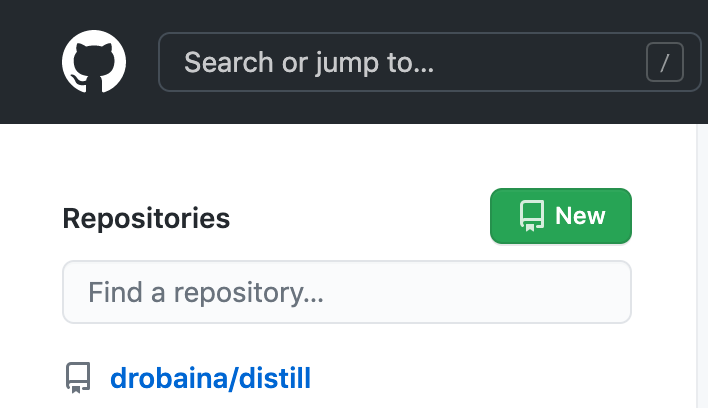

# Primeiro passo

Criar o repositório no Github.

<center>
```{r echo=FALSE, out.width = '50%'}

```
</center>


# Segundo passo

Copiar o nome do repositório criado

<center>
```{r echo=FALSE, out.width = '80%'}

```
</center>

# Segundo Passo - outra opção

Criar direto no console - sem ter que abrir o Github novamente

```
usethis::create_project("aulas2") 
```

Depois "chame" o GIT

````
usethis::use_git()
````

Clique o número referente ao 


#### Yeah - Absolutely 

Depois reiniciar

#### For sure - qualquer coisa parecida

Agora "chame" o Github

```
usethis::use_github()
```

Marque que não tem o ssh e para criar o repositório


# Terceiro Passo

Ir no RStudio e criar um novo projeto


<center>
```{r echo=FALSE, out.width = '50%'}

```
</center>

Marcar o projeto como versão de controle


<center>
```{r echo=FALSE, out.width = '50%'}
knitr::include_graphics("versaodecontrole.png")
```
</center>


Acionar o GIT 


<center>
```{r echo=FALSE, out.width = '50%'}
knitr::include_graphics("git.png")
```
</center>


E depois colar o nome do diretório criado no Github


<center>
```{r echo=FALSE, out.width = '50%'}
knitr::include_graphics("colargit.png")
```
</center>


# Quarto Passo


Instalar o pacote Distill e chamá-lo 

```
install.packages("distill")
library(distill)
```

Depois vá ao console e crie o "objeto" com maior atratividade


<center>
```{r echo=FALSE, out.width = '40%'}

```
</center>


Para explorar um pouco mais a ferramenta criarei um website


```
create_website(“ESCOLHA O DIRETÓRIO”, title = “Primeiros passos Distill” ) 

```

Os arquivos relacionados ao site serão "inseridos" dentro do diretório que você criou “ESCOLHA O DIRETÓRIO”.

Mova todos os documentos para o diretório "raiz" e exclua o diretório “ESCOLHA O DIRETÓRIO”.

### Atenção

Abra o arquivo `_site.yml` e mude a linha `output_dir: "_site"` para `output_dir: "docs"`. 

Este passo é fundamental para "carregar" o site no Github. 


# Quinto Passo

Para criar o blog você deve criar um novo arquivo RMarkdown e nomeá-lo como blog. 


<center>
```{r echo=FALSE, out.width = '50%'}

```
</center>


Force o cabeçalho a incluir a seguinte descrição

```
title: "Blog"
listing: posts
```

Após mudar o cabeçalho crie seu primeiros post.

```
library(distill)
create_post(“nome”) 
```

Escreva seu post e não esqueça de complilar com o Knit antes de finalizar a página com o Build Website. 


# Sexto Passo

Selecione os arquivos na aba GIT 

<center>
```{r echo=FALSE, out.width = '50%'}

```
</center>


faça um commit e imediatamente um push. 


# Sétimo Passo


Você agora deve iniciar a pasta do Github para exibir como webpage.

Abra o seu repositório e clique em settings

<center>
```{r echo=FALSE, out.width = '50%'}

```
</center>

Clique em pages


<center>
```{r echo=FALSE, out.width = '50%'}

```
</center>

E mude as configurações, como na imagem abaixo.


<center>
```{r echo=FALSE, out.width = '50%'}

```
</center>


